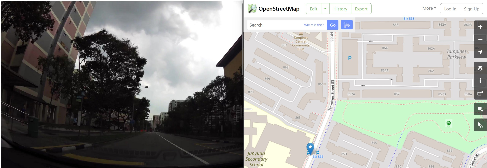

# mapillary-search

A tool that searches the Mapillary database for images within a specific bounding box.
- Using Mapillary's API, we can further add features to narrow our search.
- Further, we can restrict the images to those uploaded within a certain date range (TODO)

This is an attempt to create an updated version of scripts used in [geolocation photo retrieval automation](https://www.bellingcat.com/resources/2015/05/13/automating-photo-retrieval-for-geolocating-part-2-wikimapia/), as these guides use defunct APIs like that of Wikimapia and Panoramio.
- Unfortunately, Mapillary appears to be mostly consisting of crowd-source images of **roads**. 

## Installation
Ensure you are within the `mapillary-search` directory.

```commandline
pip install -r requirements.txt
```

## Usage
```commandline
python3 mapillary_search.py southwest northeast [-l limit] [-d detections]
```
- `southwest`: The **south-west** corner of your bounding box, expressed as Latitude, Longitude **within quotes**. Example: `"1.3518580962691118,103.93356798061131"`. No, I don't stay at these coordinates.
- `northeast`: The **north-east** corner of your bounding box, expressed as Latitude, Longitude **within quotes**. Example: `"1.3552656368803468,103.93720991127293"`
- `limit`: The maximum number of images to be extracted, ignoring images that have been filtered out by detections.
- `detections`: Features of the image to further narrow the search, 
  - See [this link](https://www.mapillary.com/developer/api-documentation/detections) for a full list of possible detections. Note that our tool does not support the detections that are unavailable for bounding box search.
  - This uses Mapillary's API to extract features of the image such as signs, trash-cans.
  - When entering the detections, enter the **value** of the detection, separated by commas without spaces.
  - Example: `object--sign--advertisement,object--trash-can` to search for images with **either** Advertisement Signs or Trash Cans.

The tool will then generate a HTML file with every extracted image. Clicking on the image links to an [OpenStreetMap](https://www.openstreetmap.org) URL with a marker on the exact coordinates of the image.

### Example
**Input**:
```commandline
py .\mapillary_search.py "1.3518580962691118,103.93356798061131" "1.3552656368803468,103.93720991127293" -l 10 -d object--sign--advertisement,object--trash-can
```

**Output**:
```
[*] Saving to log file...
[*] Saved 5 images to: mapillary-search\log\Log_2023-12-23_09-09-05.html
```



# TODO
- Implement the date range filter.